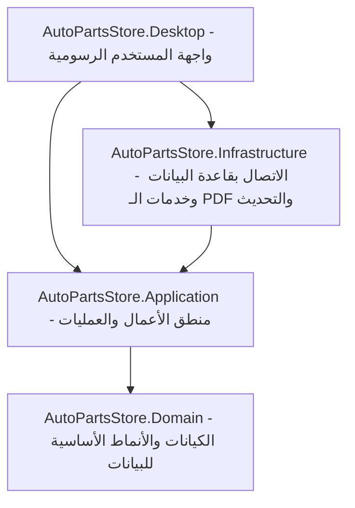

# 🚗 AutoPartsStore | نظام إدارة مستودعات ومبيعات قطع غيار السيارات

تطبيق مكتبي متكامل واحترافي مصمم خصيصاً لإدارة مخزون ومبيعات وفواتير محلات ومستودعات قطع غيار السيارات، مع التركيز على السرعة، السهولة، وتوفير تجربة مستخدم متميزة. تم بناء النظام بالاعتماد على أفضل الممارسات البرمجية وبنية برمجية نظيفة وقابلة للتوسع.

---

## 🌟 الميزات الرئيسية للبرنامج

* **📦 إدارة المخزون والمستودعات:**
  * إضافة وتعديل وحذف قطع الغيار مع إمكانية تحديد الأسعار، الأرقام التسلسلية (Part Numbers)، والكميات المتوفرة.
  * جرد وتتبع المخزون اللحظي والتنبيه عند وصول النواقص لحدود معينة.

* **🧾 نظام المبيعات والفواتير:**
  * إصدار فواتير بيع سريعة واحترافية للعملاء.
  * دعم طباعة الفواتير وحفظها بصيغة PDF.
  * حساب الإجماليات، الضرائب، والخصومات تلقائياً.

* **📊 التقارير والإحصائيات:**
  * تقارير مبيعات تفصيلية (يومية، أسبوعية، شهرية).
  * إحصائيات الأرباح والمبيعات الأكثر رواجاً لمساعدة الإدارة في اتخاذ القرار.

* **🔄 نظام التحديث التلقائي المبتكر (Auto-Updater):**
  * فحص تلقائي أو يدوي بضغطة زر لوجود إصدارات جديدة على GitHub.
  * تحميل وتثبيت التحديثات الجديدة وتنزيلها تلقائياً بدون تدخل بشري معقد، مع إبقاء البرنامج يعمل دون الحاجة لربطه بالإنترنت بشكل مستمر (Offline-First).

---

## 🛠️ التقنيات المستخدمة (Tech Stack)

* **لغة البرمجة:** C# (NET 8.0.)
* **واجهات المستخدم الرسومية:** **Avalonia UI** (إطار عمل عابر للمنصات لتشغيل البرنامج على Windows، Linux، و macOS بنفس الكفاءة والمظهر الجذاب).
* **قاعدة البيانات:** SQLite (قاعدة بيانات محلية سريعة وخفيفة الحجم وموثوقة للغاية لا تحتاج إلى خادم خارجي).
* **معمارية النظام:** **Clean Architecture** (تقسيم الكود إلى طبقات منفصلة لضمان سهولة الصيانة والتطوير المستقبلي).
* **إدارة المهام والتحديث:** GitHub Releases API.

---

## 🏗️ هيكلية المشروع (Project Architecture)

يتبع المشروع معمارية **Clean Architecture** لتقسيم المسؤوليات وفصل المنطق البرمجي عن واجهة المستخدم:



### وصف الطبقات:
1. **[AutoPartsStore.Domain](file:///home/tarek/Pictures/Desktop/DeskTop/khaled/src/AutoPartsStore.Domain):** تحتوي على الكيانات (Entities) الأساسية مثل (Item, Invoice, Category) والقواعد الثابتة للعمل.
2. **[AutoPartsStore.Application](file:///home/tarek/Pictures/Desktop/DeskTop/khaled/src/AutoPartsStore.Application):** تحتوي على حالات الاستخدام (Use Cases) والخدمات والواجهات البرمجية (Interfaces) التي تحدد منطق تشغيل التطبيق.
3. **[AutoPartsStore.Infrastructure](file:///home/tarek/Pictures/Desktop/DeskTop/khaled/src/AutoPartsStore.Infrastructure):** تقدم التطبيق الفعلي للخدمات؛ مثل الاتصال بقاعدة بيانات SQLite، معالجة ملفات الـ PDF، والتعامل مع طلبات الويب الخاصة بالتحديث التلقائي عبر الـ API.
4. **[AutoPartsStore.Desktop](file:///home/tarek/Pictures/Desktop/DeskTop/khaled/src/AutoPartsStore.Desktop):** تمثل طبقة العرض والواجهة الرسومية المبنية بـ Avalonia UI ونمط MVVM (Model-View-ViewModel).

---

## 🚀 طريقة التثبيت والتشغيل للمطورين

### المتطلبات الأساسية (Prerequisites)
* تثبيت [.NET SDK 8.0](https://dotnet.microsoft.com/download/dotnet/8.0).
* محرر أكواد مناسب مثل Visual Studio 2022 أو VS Code مع إضافة C#.

### خطوات التشغيل محلياً:

1. قم بفتح مجلد المشروع الرئيسي في منفذ الأوامر (Terminal).
2. استعادة الحزم والمكتبات المطلوبة:
   ```bash
   dotnet restore
   ```
3. تشغيل واجهة التطبيق مباشرة:
   ```bash
   dotnet run --project src/AutoPartsStore.Desktop/AutoPartsStore.Desktop.csproj
   ```

### خطوات بناء وجمع الملفات للتوزيع (Publishing):
لإنشاء نسخة تنفيذية مستقلة ومضغوطة للعملاء النهائيين، يمكنك تشغيل سكربت النشر الجاهز:
* **على Linux/macOS:**
  ```bash
  chmod +x publish.sh
  ./publish.sh
  ```
* **على Windows (PowerShell):**
  ```powershell
  ./publish.ps1
  ```
ستجد الملفات الناتجة مضغوطة باسم `publish.zip` جاهزة للرفع والنشر.

---

## ⚙️ آلية عمل التحديث التلقائي (Auto-Update Mechanism)

لقد قمنا بتصميم معمارية تحديث ذكية للغاية تجمع بين الأمان والسرعة:

1. **حماية الكود المصدري:** يتم حفظ كودك وتطويرك في مستودع خاص (Private Repo) باسم `AutoPartsStore`.
2. **نشر التحديثات للعملاء:** يتم رفع الملفات التنفيذية فقط بعد ضغطها (`publish.zip`) إلى مستودع عام (Public Repo) مخصص للإصدارات وهو `AutoPartsStore-Releases`.
3. **فحص التحديث عند العميل:** عند ضغط زر "تحديث" في البرنامج، يقوم البرنامج بإرسال طلب خفيف لـ GitHub Releases API الخاص بالمستودع العام لمعرفة رقم أحدث إصدار وتفاصيله.
4. **التحميل الذكي:** إذا كان هناك إصدار أحدث، يقوم البرنامج تلقائياً بتحميل ملف `publish.zip` العام، وفك ضغطه، واستبدال الملفات القديمة بالملفات الجديدة في ثوانٍ معدودة وبسلاسة تامة.

---

## 📞 الدعم والتطوير

تم تطوير هذا النظام وتجهيزه بعناية فائقة. إذا كانت لديك أي استفسارات أو رغبة في تطوير ميزات إضافية، يرجى التواصل مع مسؤول المشروع.

---
*صُنع هذا المشروع بكل شغف لتقديم أفضل تجربة إدارة رقمية لقطع غيار السيارات.*
